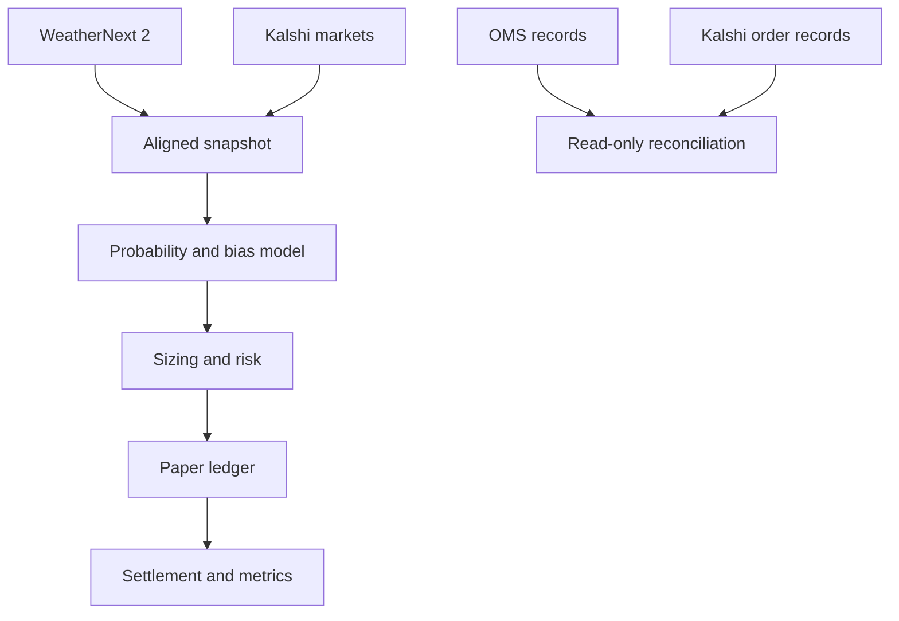

# Weather Kalshi OMS

A safety-first weather forecasting and paper-trading system for Kalshi temperature markets.

The project collects WeatherNext 2 ensemble forecasts, converts them into market probabilities, compares those probabilities with Kalshi prices, applies risk and position-sizing rules, and records pretend trades for later evaluation.

It does **not** place real Kalshi orders.

## Why this project exists

A trading signal is only one part of a reliable system. The harder engineering problems include:

- Preventing duplicate orders during retries
- Enforcing legal order-state changes
- Handling partial fills and uncertain submissions
- Limiting correlated event risk
- Reconciling local records with exchange records
- Preventing historical data leakage
- Measuring probability quality and system latency

This project implements those controls explicitly.

## Architecture



PostgreSQL stores forecasts, quotes, settlements, risk decisions, paper positions, OMS orders, and fills.

## Decision pipeline

1. Retrieve a 64-member WeatherNext 2 ensemble forecast.
2. Retrieve all six Kalshi temperature brackets.
3. Require both snapshots to exist before the decision cutoff.
4. Apply bias correction only when enough eligible historical outcomes exist.
5. Convert ensemble members into smoothed bracket probabilities.
6. Subtract Kalshi prices and fees to calculate net edge.
7. Use quarter-Kelly sizing with conservative hard limits.
8. Run the pure risk engine.
9. Save an audit decision.
10. Save a pretend position only when explicitly requested.
11. Settle the position from Kalshi’s published result.
12. Measure profit, loss, drawdown, latency, and probability quality.

## Safety controls

The current system cannot submit real orders.

Safety controls include:

- Paper mode required by the risk engine
- No authenticated POST or DELETE client
- Read-only Kalshi demo credentials
- Dry run by default
- Explicit `--save` required for pretend positions
- Forward-only paper-saving window
- Kill switch
- Minimum net-edge requirement
- Per-order contract and dollar limits
- Per-market contract limit
- Worst-case correlated event-risk limit
- Daily exposure and loss limits
- Deterministic duplicate protection
- Database uniqueness constraints

Changing an environment variable is not enough to enable live trading.

## Order Management System

The OMS implements:

- Explicit order states
- Table-driven legal state transitions
- Terminal-state protection
- Unknown-state recovery through reconciliation
- Deterministic client order IDs
- Duplicate-order collision detection
- Exchange acknowledgement recording
- Partial and complete fill handling
- Duplicate-fill protection
- Read-only comparison with Kalshi records

The reconciliation command reports differences but never repairs or changes records automatically.

## Position sizing

Position size uses quarter-Kelly:

- Full Kelly estimates the mathematically optimal risk fraction.
- Only 25% of that amount is considered.
- Hard risk limits can reduce it further.
- If one contract cannot fit safely, the trade is skipped.

The default early paper policy still permits only one contract per order. This deliberately prioritizes validation over simulated profit.

## Measurements

The analysis layer calculates:

- Mean forecast error
- Mean absolute error
- Root mean squared error
- Walk-forward bias-correction performance
- Paper profit and loss
- Win rate
- Return on cost
- Maximum drawdown
- Brier score
- Log loss
- Expected calibration error
- Minimum, mean, 95th-percentile, and maximum decision latency

Historical calculations use only information available at the original decision time.

## Setup

Requirements:

- Python 3.12
- Docker Desktop
- PostgreSQL through Docker Compose

```bash
cp .env.example .env
docker compose up -d postgres

python -m venv .venv
source .venv/bin/activate
pip install -e '.[dev]'

python -m weather_oms.storage.init_db
```

Run verification:

```bash
ruff check .
mypy src tests
pytest
```

## Important commands

Save an aligned forecast and market snapshot:

```bash
python scripts/save_decision_snapshot.py YYYY-MM-DD
```

Compare probabilities with Kalshi prices:

```bash
python scripts/compare_forecast_to_kalshi.py YYYY-MM-DD
```

Preview pretend positions:

```bash
python scripts/save_paper_positions.py YYYY-MM-DD
```

Save approved pretend positions during the permitted forward window:

```bash
python scripts/save_paper_positions.py YYYY-MM-DD --save
```

Activate the paper kill switch:

```bash
python scripts/save_paper_positions.py YYYY-MM-DD --kill-switch
```

Inspect pretend positions:

```bash
python scripts/inspect_paper_positions.py YYYY-MM-DD
```

Settle eligible pretend positions:

```bash
python scripts/settle_paper_positions.py
```

View performance:

```bash
python scripts/report_paper_performance.py YYYY-MM-DD
```

Compare local OMS records with Kalshi:

```bash
python scripts/reconcile_orders.py EVENT_TICKER
```

Reconciliation is authenticated but read-only.

## Project status

| Milestone | Status |
|---|---|
| 1. Collect one forecast | Complete |
| 2. Store forecasts and outcomes | Complete |
| 3. Bias correction | Complete |
| 4. Read Kalshi weather markets | Complete |
| 5. Forecast-to-market comparison | Complete and verified with a real aligned snapshot |
| 6. Order Management System | Complete within the no-order safety boundary |
| 7. Position sizing | Complete |
| 8. Paper trading | Implemented; forward runs are accumulating |
| 9. Backtesting and measurements | Implemented; meaningful results require more samples |
| 10. Dashboard and presentation | In progress |

## Current limitations

- Only Central Park station `KNYC` is currently validated.
- Bias correction requires at least 30 eligible prior outcomes.
- The paper fill model assumes immediate fills at the selected ask price.
- Paper results are not evidence of future profitability.
- Calibration metrics are not meaningful with very small samples.
- Reconciliation reports differences but does not automatically repair them.
- The event bus is in-process rather than durable.
- No recruiter-facing dashboard exists yet.

## Engineering decisions

### Why save snapshots?

Forecasts and prices change over time. Saving their retrieval timestamps prevents future information from entering historical decisions.

### Why deterministic IDs?

A retry after a timeout must represent the same logical action. Stable IDs prevent one decision from becoming multiple orders.

### Why an unknown order state?

A network timeout does not prove that an order failed. The exchange may have accepted it. The OMS blocks blind retries until reconciliation determines the truth.

### Why model correlated event risk?

Only one temperature bracket can win. Adding each position’s cost independently can misrepresent the true worst-case loss. The risk engine evaluates every possible winning bracket.

### Why quarter-Kelly?

Probability estimates contain error. Quarter-Kelly reduces sensitivity to overconfidence while retaining a principled connection between edge and size.

## Testing

The automated suite covers:

- Forecast parsing and storage
- Bias correction and walk-forward evaluation
- Market probability calculations
- Fees and edge calculations
- Risk rules and kill-switch behavior
- Position sizing
- Paper planning, persistence, and settlement
- Order states and invalid transitions
- Order and fill idempotency
- Reconciliation and authenticated read-only parsing
- P&L, calibration, and latency metrics

## Security

Never commit:

- `.env`
- API private keys
- PEM files
- Production credentials

Use a read-only Kalshi demo key for reconciliation.