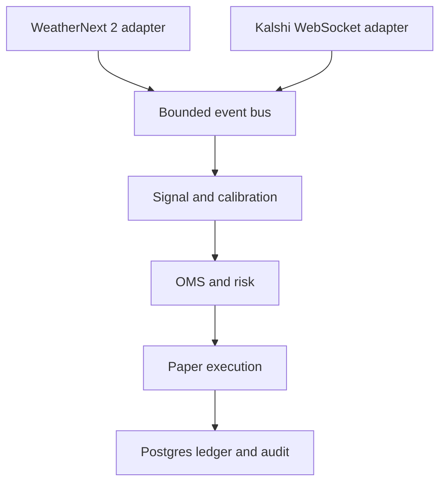

# Weather Kalshi OMS

An event-driven, paper-first trading system for Kalshi temperature markets. It combines
WeatherNext 2 ensemble forecasts with an order-management layer designed to make retries,
fills, reconciliation, and latency observable.

This is deliberately **not yet a trading strategy**. Three decision-heavy modules are left
as guided exercises so the project owner can derive and defend them:

- `signal/bias_model.py`: forecast residual model
- `oms/order_state.py` and `oms/idempotency.py`: lifecycle and retry semantics
- `oms/sizing.py`: fractional Kelly sizing

## MVP boundary

Phase 1 proves reliable event flow in paper mode for three stations. It does not promise
profitability or production-grade low latency. Live execution remains gated until model
calibration, risk controls, reconciliation, and failure-injection tests are complete.



## Important source-of-truth decisions

- Open-Meteo currently processes WeatherNext 2 at 00z and 12z, despite upstream model runs
  also existing at 06z and 18z. The system polls for freshness and emits only changed data.
- Use current Kalshi API specifications as the contract. The old `kalshi-python` SDK is
  deprecated; the current official async package is `kalshi_python_async`. This scaffold
  implements the WebSocket protocol directly so message handling remains explicit.
- Kalshi temperature settlement depends on the named NWS station. Coordinates and settlement
  rules must be verified per market before any live trading.

## Quick start

Requires Python 3.12 and Docker.

```bash
cp .env.example .env
docker compose up -d postgres
python -m venv .venv
source .venv/bin/activate
pip install -e '.[dev]'
python -m weather_oms.storage.init_db
pytest
weather-oms
```

With no Kalshi credentials, the process runs forecast ingestion only. Add demo credentials
and comma-separated market tickers to enable the authenticated market stream. Keep
`TRADING_MODE=paper`; there is intentionally no live order adapter in this milestone.

## Suggested build sequence for the owner

1. Draw the full order lifecycle—including partial fills, cancellation, rejection, and an
   unknown state after a timeout—then implement `transition()` with table-driven tests.
2. Define the economic identity of one decision, implement a deterministic idempotency key,
   and prove retry/concurrency behavior with tests.
3. Derive binary Kelly on paper, implement validation/caps/rounding, then explain why a
   fractional multiplier reduces sensitivity to probability-estimation error.
4. Build a leakage-safe historical dataset keyed by model run time, valid date, and station;
   fit the simplest bias baseline before adding complexity.

## Engineering questions this project should answer

- What happens if submission times out but Kalshi accepted the order?
- Can two workers act on the same signal without placing duplicates?
- How is an order-book snapshot sequenced with subsequent deltas after reconnect?
- Which timestamp defines forecast availability in a backtest?
- Where is latency spent: ingest, signal, persistence, routing, or exchange acknowledgement?
- How does performance change after fees, spread, slippage, and probability calibration?

## Current limitations

- The paper fill model is intentionally simple and optimistic.
- Forecast model-run metadata still needs a normalized parser and durable ingestion worker.
- Reconciliation is a pure diff; automatic repair policy is not yet implemented.
- No dashboard or historical NWS observations are included in Phase 1.
- The event bus is in-process; a durable log (Redpanda/Kafka/NATS JetStream) is a later step,
  justified only after failure recovery and replay requirements are measured.

## Safety

Never commit `.env` or PEM keys. Develop against Kalshi's demo environment. Enabling live
execution should require an explicit code path, startup acknowledgement, hard exposure caps,
and a kill switch—not merely changing an environment string.

## Milestones

Milestone 1: Collect one forecast
Get WeatherNext data for Central Park and understand it.


Milestone 2: Save forecasts and actual temperatures
Store what WeatherNext predicted and what temperature actually occurred.
This gives us the historical information needed to answer:
How wrong was WeatherNext?


Milestone 3: Build your bias-correction model
Use previous forecast mistakes to improve future forecasts.
This is one of the three core parts you will personally build.


Milestone 4: Read one Kalshi weather market
Receive the prices and understand exactly what the market means and how it settles.


Milestone 5: Compare our probability with Kalshi’s price
Determine whether a possible opportunity exists.
Still no orders yet.


Milestone 6: Build the Order Management System
Design and implement:
Order states
Safe state changes
Duplicate-order protection
Checking our records against Kalshi’s records
This is the main systems-engineering portion of the project.


Milestone 7: Build position sizing
Decide how much pretend money to risk.


Milestone 8: Paper trading
Run the full system using pretend money.


Milestone 9: Backtesting and measurements
Measure:
Prediction accuracy
Profit or loss
How quickly the system reacts
Whether probabilities are trustworthy


Milestone 10: Dashboard and project presentation
README
Architecture explanation

